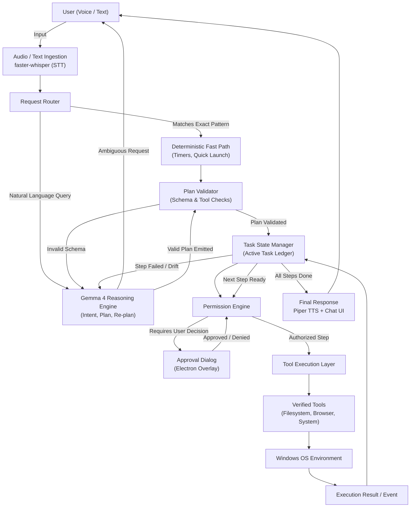
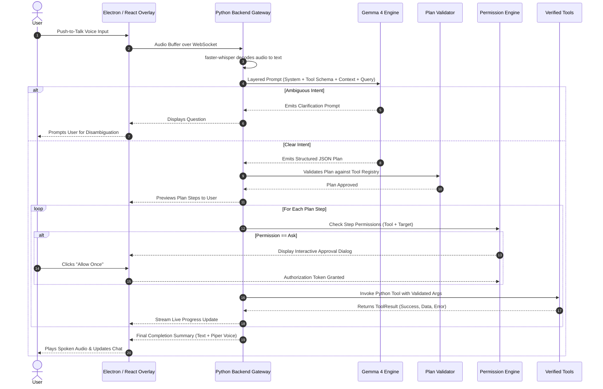
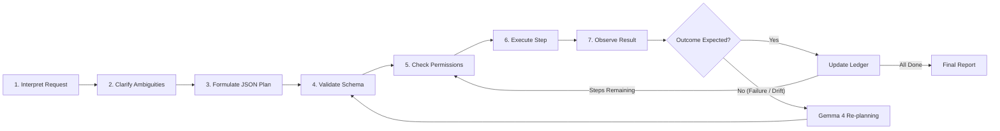
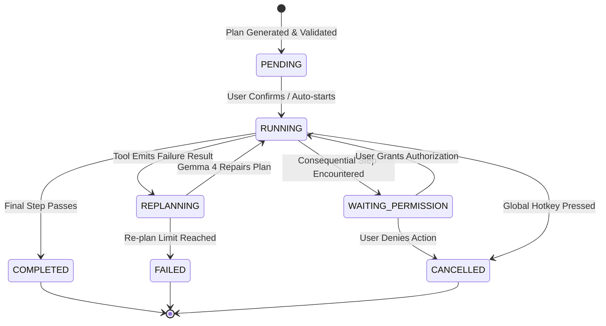

# SprintBot

> **A Gemma 4-powered desktop assistant. You describe what you want done on your computer; Gemma 4 reasons through the plan, verified Python tools execute it, and deterministic permission boundaries keep the user in complete control.**

**Team Phoenix** · Open Source AI Hackathon (Hacktober Fest, organized by Elevate) · Track: *Best Use of Gemma 4 / Gemma 4 Open-Source*

---

### Scope & Status Labels

| Label | Definition |
|---|---|
| **[MVP]** | Core target committed for the final hackathon demo |
| **[Stretch]** | Secondary features built if MVP components pass stability tests early |
| **[Future]** | Architectural roadmap items designed for, but post-hackathon |

---

## 1. Project Name

| Field | Detail |
|---|---|
| **Project Name** | SprintBot |
| **Team** | Phoenix |
| **Primary AI Engine** | Gemma 4 (`gemma-4-12b-it` / `gemma-4-e4b`) |
| **Platform Target** | Windows 10 / 11 Desktop (MVP) |
| **Repository Type** | Qualifier Technical Proposal |

---

## 2. Problem Statement

Everyday computer workflows are packed with repetitive, multi-step chores: organizing downloaded course material, sorting messy directories, capturing periodic screenshots during long test runs, or figuring out cryptic desktop error dialogues. 

Users still handle these manually because existing solutions have major architectural flaws:

1. **Fixed Automation & Macros:** Rigid scripts and voice shortcuts require exact commands and pre-configured paths. They fail completely on conversational intent like *"move today's assignment from downloads into my college folder"*.
2. **Standard Chatbots:** Conversational models understand intent, but they are isolated in a browser sandbox. They offer advice instead of executing tasks on the host machine.
3. **Unconstrained Autonomous Agents:** Letting an LLM generate arbitrary Python scripts or click blind desktop coordinates is dangerous and brittle. Coordinate-based clicking fails whenever display scaling (DPI) shifts, windows move, or popups appear. Worse, executing arbitrary generated shell commands on a user's local operating system invites silent data loss, accidental file deletion, or command-injection exploits.

SprintBot bridges the gap between **natural language intent** and **safe, deterministic desktop execution**.

---

## 3. Project Overview

SprintBot is a general-purpose, voice- and text-driven Windows desktop assistant. The user states a goal in plain English, and SprintBot figures out the steps, validates them against safe boundaries, and executes them step-by-step.

The architecture strictly decouples **reasoning** from **execution**:

* **Gemma 4 (Intelligence Layer):** Parses messy natural language, identifies missing parameters, formulates structured JSON execution plans, inspects desktop screenshots when visual understanding is needed, and re-plans when real-world execution hits a blocker.
* **Verified Python Tools (Execution Layer):** A registry of purpose-built, developer-tested tools that carry out specific OS operations (filesystem modifications, browser navigation, application launches, and system timers).
* **Application Runtime (Safety & State Layer):** The Python/FastAPI host manages live task state, validates every argument against strict schemas, and enforces fine-grained user permissions.

```text
Gemma 4 plans and reasons; verified deterministic tools execute.
```

The system expands over time by adding tested tools to the registry, never by allowing the model to generate and execute uncontrolled scripts.

---

## 4. Proposed Solution

SprintBot puts an explicit validation and authorization checkpoint between model planning and OS-level execution.

```text
               User Request (Voice or Text)
                            │
                            ▼
              Request Router & Fast-Path Check
             ┌──────────────┴──────────────┐
   [Exact Match Pattern]         [Complex / Ambiguous Intent]
             │                                     │
             ▼                                     ▼
     Deterministic Fast Path              Gemma 4 Reasoning Engine
             │                       (Clarify, Plan, or Inspect Screen)
             │                                     │
             └──────────────┬──────────────────────┘
                            ▼
                Structured JSON Plan Generator
                            │
                            ▼
           Plan Validator (Registry Schema Check)
                            │
                            ▼
          Permission Engine (Allow / Ask / Deny)
               ├── Requires Approval ──► Interactive UI Prompt
               └── Authorized
                            │
                            ▼
                 Verified Tool Execution
               (Filesystem, Browser, Shell, GUI)
                            │
                            ▼
               Observation & Ledger Update
             ┌──────────────┴──────────────┐
       [Success]                     [Unexpected Result]
             │                                     │
     Execute Next Step              Gemma 4 Re-planning Loop
             │                                     │
             ▼                                     ▼
    Final Spoken & Text Report       Prompt User / Adjust Path
```

### Core Design Trade-offs

| Architectural Decision | Chosen Approach | Alternative Considered | Engineering Rationale |
|---|---|---|---|
| **Task Execution** | Plan-first, then execute step-by-step | Autonomous step-by-step loop (ReAct) | Autonomous loops drift easily and can trigger dangerous actions before the user notices. Generating a full plan lets the user inspect what is about to happen before execution begins. |
| **Tool Execution** | Fixed registry of developer-tested tools | LLM-generated Python/Bash execution | Arbitrary code generation on a local desktop is a massive security risk. A strictly typed tool catalog guarantees predictable parameters and sandboxed operations. |
| **Safety Boundary** | Deterministic app-level permission engine | Prompt-based safety ("Be safe and ask") | LLM prompts can be bypassed or jailbroken. Safety rules (file overwrite guards, delete confirmations) must be enforced by deterministic Python code. |
| **State Ownership** | Application task ledger | LLM conversation context | Keeping task status, intermediate outputs, and dependencies in memory inside Python prevents token bloat and keeps execution state resilient across network drops. |
| **Visual Reasoning** | On-demand screen captures | Continuous video/screen streaming | Streaming desktop frames burns bandwidth, raises latency, and exposes private data. SprintBot grabs a single screenshot only when a tool or step explicitly flags a visual dependency. |

---

## 5. Objectives

1. **Natural-Language Desktop Control:** Allow users to initiate multi-step computer tasks via voice or text without memorizing syntax or folder paths.
2. **Dedicated Intelligence Boundary:** Restrict Gemma 4 to tasks requiring semantic reasoning (intent parsing, argument extraction, plan generation, re-planning, and screenshot diagnostics).
3. **Deterministic Safety:** Route all OS interactions through developer-verified Python tools gated by a strict Allow / Ask / Deny permission engine.
4. **Active Ambiguity Resolution:** Proactively ask clarifying questions instead of hallucinating paths, URLs, or file names when requests are ambiguous.
5. **Zero-Token Background Work:** Manage timers, periodic checks, and file watchers using native Python schedulers without wasting model tokens.
6. **User Sovereignty:** Provide real-time plan previews, granular scoped authorizations, a UI cancel button, and an OS-level global kill-switch hotkey (`Ctrl+Shift+Escape`).
7. **Extensible Architecture:** Enable new capabilities by dropping modular tool definitions into the registry without modifying core engine logic.

---

## 6. Target Users / Use Case

### Target Audience
* **Students & Academics:** Automating repetitive study workflows (downloading course material, sorting lecture notes, moving assignments into organized directory structures).
* **Power Users & Remote Workers:** Automating multi-step digital chores (scheduled screen auditing, batch renaming, periodic backup checks) without writing brittle shell scripts.
* **Non-Technical Desktop Users:** Getting plain-English explanations of confusing desktop errors and dialog boxes without needing to copy-paste error codes into search engines.

### Concrete Scenarios

| User Intent | SprintBot Execution Flow | Architectural Concept |
|---|---|---|
| *"Check my course portal, download today's assignment, and save it in my College folder."* | Identifies missing URL/folder parameters $\rightarrow$ Prompts user $\rightarrow$ Navigates browser $\rightarrow$ Downloads file $\rightarrow$ Checks for existing file collision $\rightarrow$ Moves file safely $\rightarrow$ Confirms completion. | Clarification loop, multi-step planning, file collision checks. |
| *"Take a screenshot every 2 minutes for the next 20 minutes."* | Gemma 4 emits a single scheduled plan $\rightarrow$ Python scheduler executes 10 captures locally $\rightarrow$ Stores files without any ongoing LLM calls. | Zero-token background scheduling. |
| *"Look at my screen and tell me why this installer is failing."* | Hides assistant overlay $\rightarrow$ Grabs clean desktop frame $\rightarrow$ Sends crop to Gemma 4 $\rightarrow$ Synthesizes plain-English diagnostic. | Event-driven multimodal visual grounding. |
| *"Delete output_log.txt."* | Resolves target path $\rightarrow$ Prompts user for explicit confirmation $\rightarrow$ Moves file to **Windows Recycle Bin** (never permanent unlinked deletion). | Non-destructive deletion & permission engine. |
| *"Organize today's PDFs."* (Multiple matching files found) | Discovers matching files $\rightarrow$ Pauses execution $\rightarrow$ Lists candidates in UI and asks for user selection before moving anything. | Disambiguation over assumption. |
| *"Set a timer for 15 minutes."* | Pattern matches fast-path regex $\rightarrow$ Dispatches native Python timer immediately without touching the LLM. | Low-latency deterministic routing. |

---

## 7. Open-Source AI Technology Selected

| Component | Selected Technology | Role in SprintBot | License |
|---|---|---|---|
| **Core Reasoning & Vision** | **Gemma 4** (`gemma-4-12b-it` / `gemma-4-e4b`) | Intent classification, plan formulation, re-planning, native function calling, and screenshot comprehension | Apache 2.0 |
| **Speech-to-Text (STT)** | **faster-whisper** (Whisper-medium / base) | Local, GPU-accelerated voice transcription for push-to-talk input | MIT |
| **Text-to-Speech (TTS)** | **Piper TTS** | Low-latency, lightweight local voice synthesis for assistant feedback | MIT |
| **Agent Orchestration** | **Google ADK** *(Evaluated)* / Custom Python Engine | Structured plan generation, tool dispatch, and ledger management | Apache 2.0 |

Gemma 4 acts as the sole intelligence engine. All supporting AI runtimes (STT/TTS) operate locally, keeping speech data on the user's workstation.

---

## 8. Why This Technology Was Selected

### 1. What was selected
Google DeepMind's **Gemma 4** open-weight model family, specifically targeting `gemma-4-12b-it` for balanced local/workstation execution and `gemma-4-e4b` for edge constraints.

### 2. Why it was selected over alternatives
* **Unified Multimodal Architecture:** Gemma 4 natively processes both text prompts and visual inputs within a single parameter weights family. This eliminates the latency and orchestration overhead of stitching separate language and vision models together.
* **Native Tool Calling & Structured Output:** Gemma 4 is trained for native function calling and strict schema compliance, which is critical for emitting valid JSON plans on the first pass.
* **Permissive Open-Source Licensing:** Released under **Apache 2.0**, Gemma 4 allows unrestricted modification, local hosting, and private deployment without restrictive commercial rider clauses.

### 3. What problem it solves in the system
SprintBot requires an engine that can translate ambiguous human speech into structured operational sequences, reason about dependencies (e.g. *cannot move a file before download completes*), and diagnose visual desktop state when programmatic inspection fails. Gemma 4 provides this exact blend of reasoning and computer vision.

### 4. How it interacts with other components
* **FastAPI Backend:** Communicates with Gemma 4 using the Google Gen AI SDK (cloud development) or a local runtime endpoint (`llama.cpp` / Ollama) via standard OpenAI/GenAI-compatible schemas.
* **Tool Registry:** The backend inspects Python tool docstrings, compiles them into a JSON Schema tool catalog, and passes them to Gemma 4's system prompt context.
* **Plan Validator:** Ingests Gemma 4's JSON output, checks signatures against the registry, and feeds validation error strings back to the model if repairs are needed.

### 5. Input / Output Flow

```text
Inputs to Gemma 4:
├── System Prompt (Operational role, safety constraints, output schema)
├── Dynamic Tool Catalog (JSON Schema of active Python tools)
├── Task Ledger Context (Current step index, prior step outputs, confirmed paths)
├── User Prompt (Transcribed voice or typed text)
└── Image Buffer (MSS screenshot crop, included ONLY when vision is requested)

Outputs from Gemma 4:
├── Structured Plan (Valid JSON containing steps, arguments, and dependencies)
├── Clarification Request (Targeted question when inputs are ambiguous)
└── Natural Language Summary (Diagnostic explanation or completion report)
```

### 6. Why an open-source approach suits the project
A desktop assistant has direct access to user files, directory listings, and active desktop windows. Routing this sensitive context through black-box, proprietary APIs creates privacy and compliance issues. An open-weight model allows full on-premises deployment, giving users total control over their data.

---

## 9. AI's Role in the System

### 9.1 Boundary of Responsibility

```text
            REASONING (Gemma 4)                    EXECUTION (Deterministic Python)
  ┌──────────────────────────────────────┐     ┌──────────────────────────────────────┐
  │ • Semantic intent interpretation     │     │ • Schema validation & type checking  │
  │ • Ambiguity detection & questions    │     │ • Path resolution & collision checks │
  │ • Task decomposition & step ordering │ ──► │ • Allow / Ask / Deny permission checks│
  │ • Visual screenshot diagnostics      │     │ • Process execution (PyAutoGUI/MSS)  │
  │ • Failure analysis & re-planning     │     │ • Background timers & file watchers  │
  └──────────────────────────────────────┘     └──────────────────────────────────────┘
```

Gemma 4 is treated as a **planner and advisor, never as an executor**. The model cannot execute shell commands, allocate permissions, or modify files directly.

### 9.2 Layered Prompt Architecture

Every payload delivered to Gemma 4 is constructed dynamically from six distinct layers:

```text
┌────────────────────────────────────────────────────────────────────────┐
│ 1. SYSTEM CONTEXT                                                      │
│    Role definition, anti-hallucination rules, JSON schema specification │
├────────────────────────────────────────────────────────────────────────┤
│ 2. DYNAMIC TOOL CATALOG                                                │
│    JSON Schema definitions generated directly from Python tool code    │
├────────────────────────────────────────────────────────────────────────┤
│ 3. ACTIVE TASK LEDGER                                                  │
│    Current step, execution status, verified return values of prior steps│
├────────────────────────────────────────────────────────────────────────┤
│ 4. ENVIRONMENT FACTS                                                   │
│    OS version (Windows 11), confirmed base paths (e.g., Desktop, User)  │
├────────────────────────────────────────────────────────────────────────┤
│ 5. USER PROMPT                                                         │
│    Raw voice transcript or typed text request                          │
├────────────────────────────────────────────────────────────────────────┤
│ 6. SCREENSHOT BUFFER (OPTIONAL)                                        │
│    Downsampled, clean desktop capture (attached only if visual flag is set)│
└────────────────────────────────────────────────────────────────────────┘
```

---

## 10. System Architecture



### Trust & Isolation Boundaries
1. **Model Output as Untrusted Proposal:** All JSON structures generated by Gemma 4 are treated as untrusted user input until verified by Python type checkers.
2. **Deterministic Fast Path:** Common commands (e.g., *"set a timer for 10 minutes"*) bypass the LLM entirely, matching against pre-compiled regex patterns to eliminate latency and token overhead.
3. **Screen Content as Data:** Text or instructions visible inside user screenshots are treated strictly as passive image data, preventing prompt-injection attacks from malicious websites or documents.

---

## 11. Component-Level Architecture

### 11.1 Component Matrix

| Module | Responsibility | Primary Stack | Scope |
|---|---|---|---|
| **Desktop Shell** | Non-intrusive floating bar, modal dialogs, global hotkey handling | Electron (Context Isolation, Preload IPC) | **[MVP]** |
| **Overlay UI** | Chat stream, step-by-step plan visualizer, permission prompts | React 18, TypeScript, Vite | **[MVP]** |
| **Backend Gateway** | Local API server, WebSocket event dispatcher | Python 3.11+, FastAPI, Uvicorn | **[MVP]** |
| **Speech Pipeline** | Push-to-talk voice capture, audio decoding, speech synthesis | faster-whisper, Piper TTS, sounddevice | **[MVP]** |
| **Gemma Integration** | Prompt compilation, structured function calling, vision handling | Google Gen AI SDK / `llama.cpp` wrapper | **[MVP]** |
| **Plan Validator** | Pydantic schema validation, tool signature verification | Pydantic v2 | **[MVP]** |
| **Task State Ledger** | Step tracking, state transitions, runtime variable store | Python State Machine | **[MVP]** |
| **Permission Engine** | Allow/Ask/Deny rules, session overrides, persistent store | Python (JSON-backed policy store) | **[MVP]** |
| **Tool Registry** | Docstring-driven reflection, dynamic catalog generation | Python `inspect` module | **[MVP]** |
| **Filesystem Tools** | Safe directory creation, file moving, Recycle Bin deletion | Python `os`, `shutil`, `send2trash` | **[MVP]** |
| **Visual Ingestion** | Headless screen capture with window-hide coordination | MSS, Pillow | **[MVP]** |
| **Browser Driver** | Headless/headed web automation for assignment downloads | Playwright for Python | **[MVP]** |
| **GUI Automation** | Fallback mouse and keyboard simulation | PyAutoGUI | **[MVP]** |
| **Desktop Automation** | Native element inspection for standard Windows applications | pywinauto | **[Stretch]** |

### 11.2 Frontend / Backend Separation

* **Zero OS Privileges in Renderer:** The React UI runs inside an Electron renderer with full context isolation. It cannot touch the Windows filesystem, shell, or network directly.
* **Local WebSocket IPC:** The Electron shell communicates with the Python backend over a local loopback WebSocket connection (`ws://127.0.0.1:8765`).
* **Visual Frame Isolation:** When taking a screenshot, the backend sends a `HIDE_OVERLAY` signal to Electron. The UI hides immediately, MSS grabs the desktop framebuffer, and a `RESTORE_OVERLAY` signal restores the UI in under 120ms, preventing the assistant from capturing its own interface.

### 11.3 Verified Tool Architecture

Tools are standard Python functions decorated to register with the engine. The docstring and typing annotations automatically generate the model's tool catalog:

```python
from pydantic import BaseModel
from typing import Dict, Any

class ToolResult(BaseModel):
    success: bool
    data: Dict[str, Any]
    error: str | None = None

def move_file(source_path: str, destination_folder: str) -> ToolResult:
    """Move a file to a specified destination directory.
    
    Args:
        source_path: Absolute path to the source file.
        destination_folder: Absolute path to the target folder.
    """
    # Deterministic safety: Fails if target exists, preventing silent overwrites
    ...
```

Every tool returns a uniform `ToolResult` payload containing execution telemetry, making observation parsing completely deterministic.

### 11.4 Repository Structure

```text
SprintBot/
├── README.md                      # Qualifier technical proposal & project specification
├── apps/
│   ├── desktop/                   # Electron desktop wrapper (main, preload, hotkeys)
│   └── ui/                        # React + TypeScript floating assistant interface
├── engine/
│   ├── server.py                  # FastAPI gateway & WebSocket event router
│   ├── router.py                  # Fast-path regex matching & LLM dispatcher
│   ├── planner/                   # Gemma 4 prompt assembler & schema definitions
│   ├── validator/                 # Pydantic-based plan & argument validators
│   ├── state/                     # Task ledger & step state machine
│   ├── permissions/               # Allow / Ask / Deny policy evaluator
│   └── scheduler/                 # Native interval & cron task runner
└── tools/                         # Modular verified Python tools
    ├── registry.py                # Reflection engine & catalog generator
    ├── filesystem.py              # Safe file ops (move, list, recycle bin)
    ├── browser.py                 # Playwright navigation & download handlers
    ├── system.py                  # Timers, app launchers, system diagnostics
    └── vision.py                  # MSS screenshot capture & image cropping
```

---

## 12. Data / Information Flow



### Data Flow Stages

| Step | Operation | Source Data | Transformed Output | Runtime Boundary |
|---|---|---|---|---|
| **1. Audio Ingestion** | Push-to-talk capture | Microphone raw PCM | 16kHz mono audio buffer | Local (Electron) |
| **2. Transcription** | Speech decoding | Audio buffer | Clean text transcript | Local (`faster-whisper`) |
| **3. Intent Routing** | Fast-path check | Text string | Match status or LLM prompt | Local (Python) |
| **4. Plan Generation** | Task decomposition | Layered prompt | Structured JSON plan | Gemma 4 |
| **5. Plan Validation** | Schema verification | Raw JSON plan | Verified executable AST | Local (Pydantic v2) |
| **6. Permission Check** | Security evaluation | Tool name + arguments | Access granted / user prompt | Local (Policy Engine) |
| **7. Tool Execution** | OS interaction | Typed arguments | `ToolResult` JSON object | Local (Python runtime) |
| **8. State Observation**| Ledger update | `ToolResult` | Step completed / re-plan trigger | Local (Task Ledger) |
| **9. Response** | User synthesis | State summary | Spoken audio + Markdown text | Local (Piper TTS) |

---

## 13. Agentic Workflow

### 13.1 Operational Lifecycle



### 13.2 State Ownership Matrix

| Operational Question | Responsible Subsystem | Implementation Mechanism |
|---|---|---|
| *What is the user trying to accomplish?* | **Gemma 4** | Layered prompt understanding |
| *Are required paths, targets, or parameters missing?* | **Gemma 4** | Semantic ambiguity detection |
| *What exact steps and tools are required?* | **Gemma 4** (Proposes) / **Validator** (Enforces) | JSON Schema validation |
| *Where is active plan progress recorded?* | **Application State Ledger** | In-memory Python task store |
| *Is this specific tool call authorized?* | **Permission Engine** | Deterministic Allow/Ask/Deny policy |
| *Did the execution succeed or encounter an error?* | **Tool Executor** | Standardized `ToolResult` evaluation |
| *When should the model be invoked again?* | **Task State Manager** | Triggered only on unexpected step outcomes or explicit vision requests |

### 13.3 Structured Plan Specification

Gemma 4 returns structured plans conforming to a strict schema. Below is a validated payload for a multi-step download and move workflow:

```json
{
  "goal": "Download today's course assignment and file it in College folder",
  "steps": [
    {
      "step_id": "step_1",
      "tool": "browser_download_file",
      "args": {
        "url": "https://portal.university.edu/assignments",
        "link_text": "Assignment 4 - Networks.pdf"
      },
      "depends_on": [],
      "on_failure": "abort"
    },
    {
      "step_id": "step_2",
      "tool": "move_file",
      "args": {
        "source_path": "{step_1.downloaded_path}",
        "destination_folder": "C:/Users/prana/Documents/College/Networks"
      },
      "depends_on": ["step_1"],
      "on_failure": "replan"
    }
  ]
}
```

#### Anti-Hallucination Constraints
1. **Tool Existence Check:** The `tool` property must strictly match an identifier registered in the active tool catalog.
2. **Provenance Verification:** Concrete filesystem paths and URLs must originate either from the user's explicit prompt or from the verified output of an earlier step (e.g. `{step_1.downloaded_path}`). Fabricated paths trigger immediate rejection.
3. **DAG Validation:** The `depends_on` array must define a valid Directed Acyclic Graph with zero circular references.

### 13.4 Task Lifecycle State Machine



### 13.5 Observation & Bounded Re-Planning

When a tool returns an unexpected error (e.g., file not found, browser selector missing), SprintBot executes an observation cycle:

1. **Context Isolation:** The backend isolates the failure telemetry (tool name, arguments, error string, and remaining plan steps).
2. **Targeted Re-plan Call:** Gemma 4 receives only the failure context—not the entire historical chat log—preventing context drift.
3. **Hard Re-plan Ceiling:** Re-planning is hard-capped at **2 attempts per task**. If the second repair fails, execution halts immediately and prompts the user.
4. **Zero Permission Inheritance:** If a repaired plan introduces new tools or targets, it must pass fresh permission checks.

### 13.6 Background & Scheduled Tasks

Background operations do not consume LLM inference loops:

| User Request | Model Involvement | Deterministic Python Runtime |
|---|---|---|
| *"Take a screenshot every 5 minutes for 1 hour"* | Single planning call (emits schedule definition) | APScheduler triggers 12 captures via local MSS tools |
| *"Notify me when large_model.bin finishes downloading"* | Single planning call | File watcher polls filesystem size until write lock releases |
| *"Check every 10 minutes if server is up"* | Single planning call | Native HTTP heartbeat check via `httpx` |

### 13.7 Scoped Permissions & Emergency Kill Switch

Actions are categorized into four security tiers:

| Tier | Operations | Policy |
|---|---|---|
| **Read-Only** | Directory listing, file reading, system inspection | **Allow by Default** (Silent execution) |
| **Modifying** | Moving files, copying, renaming, web form submission | **Ask by Default** (Interactive prompt) |
| **Destructive** | File deletion, overwriting existing files | **Always Ask** (Mandatory modal prompt; files routed to Recycle Bin) |
| **System** | OS shutdown, restarting services, process termination | **Always Ask** |

#### User Authorization Options
* **Allow Once:** Authorizes the single atomic step.
* **Allow for Session:** Authorizes matching actions on the target directory until SprintBot exits.
* **Deny:** Halts the step immediately and triggers plan cancellation.

#### Emergency Kill Switch
Users can press **`Ctrl+Shift+Escape`** (configurable in settings) at any moment. Electron captures this global OS shortcut, immediately revokes active tool execution tokens, terminates child processes, and restores normal keyboard and mouse focus.

---

## 14. Technology Stack

```text
┌────────────────────────────────────────────────────────────────────────┐
│ FRONTEND (Electron + React 18 + TypeScript + Vite)                     │
│ Floating Desktop Widget • Plan Step Visualizer • Scoped Permission UI   │
└───────────────────────────────────┬────────────────────────────────────┘
                                    │ Local WebSocket (ws://127.0.0.1:8765)
┌───────────────────────────────────▼────────────────────────────────────┐
│ BACKEND GATEWAY (Python 3.11+ • FastAPI • Uvicorn)                     │
│ Event Router • Request Dispatcher • Task Ledger • Permission Evaluator │
└───────┬───────────────────────────┬───────────────────────────┬────────┘
        │                           │                           │
┌───────▼─────────────┐     ┌───────▼─────────────┐     ┌───────▼────────┐
│ SPEECH ENGINE       │     │ REASONING ENGINE    │     │ TOOL REGISTRY  │
│ • faster-whisper    │     │ • Gemma 4 (12B/E4B) │     │ • Playwright   │
│ • Piper TTS         │     │ • Google Gen AI SDK │     │ • MSS (Screen) │
│ • sounddevice       │     │ • Local llama.cpp   │     │ • send2trash   │
└─────────────────────┘     └─────────────────────┘     └────────────────┘
```

| Subsystem | Technology | Purpose |
|---|---|---|
| **Reasoning Model** | **Gemma 4** (`12b-it` / `e4b`) | Core semantic planning, tool calling, and multimodal reasoning |
| **Model Interface** | **Google Gen AI SDK** | High-throughput cloud API access during development and testing |
| **Local Inference Runtime** | **llama.cpp / Ollama** *(Evaluation)* | On-device, private quantized model execution |
| **Desktop Framework** | **Electron** | Desktop window management, frameless overlays, global hotkeys |
| **User Interface** | **React 18 + TypeScript** | Reactive desktop UI components, plan tree visualization |
| **Build Tooling** | **Vite** | Modern, fast frontend bundling |
| **API Server** | **FastAPI + Uvicorn** | High-concurrency local backend server |
| **Speech-to-Text** | **faster-whisper** | Low-latency local voice transcription |
| **Text-to-Speech** | **Piper TTS** | Natural-sounding local voice synthesis |
| **Screen Ingestion** | **MSS + Pillow** | Fast desktop framebuffer capture |
| **Web Automation** | **Playwright** | Robust browser navigation and file download handling |
| **Desktop Automation** | **PyAutoGUI** | Fallback mouse and keyboard event simulation |
| **Task Scheduling** | **APScheduler** | Deterministic cron and interval background triggers |

---

## 15. Expected Features

| Feature | Description | Status |
|---|---|---|
| **Voice & Text Dual Input** | Natural language queries via push-to-talk voice button or text box | **[MVP]** |
| **Spoken Responses** | Immediate, low-latency audio feedback via Piper TTS | **[MVP]** |
| **Ambiguity Clarification** | Interactive questions when paths, targets, or intentions are unclear | **[MVP]** |
| **Structured Plan Visualizer**| Step-by-step preview showing tools, parameters, and execution state | **[MVP]** |
| **Permission Confirmation UI**| Interactive dialogs for approving or denying file and system operations | **[MVP]** |
| **Recycle Bin Safe Delete** | File deletions route through Windows Recycle Bin using `send2trash` | **[MVP]** |
| **Deterministic Fast Path** | Regex-based instant execution for timers and known single commands | **[MVP]** |
| **Zero-Token Scheduling** | Interval and cron screenshot captures managed by local Python runtime | **[MVP]** |
| **Multimodal Screen Analysis**| On-demand screenshot crop and visual explanation of screen errors | **[MVP]** |
| **Emergency Kill Switch** | Global hotkey (`Ctrl+Shift+Escape`) instantly terminates active jobs | **[MVP]** |
| **Browser Workflow Execution**| Navigating confirmed student portals and pulling assignment downloads | **[MVP]** |
| **Native Windows UI Control** | Element-level interaction with legacy desktop apps via pywinauto | **[Stretch]** |
| **Visual Element Grounding** | Point-and-click automation targeting screen icons identified by vision | **[Stretch]** |

---

## 16. Implementation Approach

### 16.1 Phased Engineering Milestones

```text
Phase 1: Foundations
└── Electron + React floating shell, FastAPI server, loopback WebSocket IPC

Phase 2: Tool Registry & Validation
└── Verified tool decorator, docstring introspection, Pydantic schema validation

Phase 3: Gemma 4 Planning Core
└── Layered prompt assembler, structured JSON plan parser, clarification handler

Phase 4: Execution Engine & State Machine
└── Step-by-step runner, task ledger, error observation, bounded re-planner

Phase 5: Safety Subsystem
└── Allow/Ask/Deny permission evaluator, Recycle Bin integration, kill-switch hotkey

Phase 6: Multimodal Pipeline
└── faster-whisper push-to-talk, Piper voice output, MSS window-hide capture flow

Phase 7: End-to-End Validation
└── Course assignment download workflow, scheduled capture testing, demo hardening
```

### 16.2 Deployment & Execution Strategy

* **Local-First Architecture:** SprintBot runs as a standalone desktop package. The Electron app launches and binds to a locally spawned Python backend on `127.0.0.1`.
* **Hybrid Model Execution:** 
  * *Development & Hackathon Demo:* Gemma 4 accessible via Google Gen AI SDK for high-speed plan generation and low latency.
  * *Local Evaluation:* Quantized `gemma-4-12b-it` (GGUF format via `llama.cpp` or Ollama) evaluated on a target workstation with 16GB RAM and modern GPU acceleration to verify complete offline capability.

### 16.3 Quantitative Evaluation Metrics

SprintBot's architecture will be validated against a test suite of 30 benchmark tasks:

1. **First-Pass Plan Validity Rate:** Target $> 90\%$ of generated plans passing Pydantic schema checks on first generation.
2. **Clarification Precision:** Rate at which the system identifies underspecified requests without making false assumptions.
3. **Safety Compliance Rate:** Exactly $100\%$ compliance; zero side-effecting operations execute without passing permission checks.
4. **Recovery Rate:** Successful plan repair rate on injected failures (e.g., simulating missing files or destination collisions).
5. **Fast-Path Latency:** Sub-50ms dispatch on matching deterministic commands.

---

## 17. Expected Final Output

The final hackathon deliverable is a functional Windows desktop application featuring:

1. **Floating Desktop HUD:** A clean, draggable desktop interface with a push-to-talk voice button and expandable chat console.
2. **Interactive Plan Visualizer:** Live progress tracking showing the active plan, running steps, and parameter details.
3. **Live Course Assignment Workflow:** A complete demonstration where the user issues a voice request (*"Download my networks assignment and put it in my college folder"*), answers a clarifying question, approves the destination, and watches SprintBot complete the file organization.
4. **Scheduled Background Automation:** Demonstrating a recurring screenshot task running locally without any continuous model calls.
5. **Visual Diagnostic Assistant:** Taking an on-demand screen capture of a desktop application error and providing a clear explanation of the cause.

---

## 18. Future Scope & Scalability

* **Extensible Plugin Ecosystem:** A standard packaging specification allowing third-party developers to publish and install community-verified tools.
* **Model Context Protocol (MCP) Integration:** Adding native MCP client support to allow SprintBot to interact with existing MCP servers (databases, GitHub, Slack).
* **Cross-Platform Support:** Porting desktop windowing and automation hooks to macOS and Linux.
* **Complete Offline Bundling:** Bundling an optimized `gemma-4-e4b` on-device model directly into the desktop installer for an end-to-end air-gapped personal assistant.
* **Multi-Language Expansion:** Adding localized STT models and multilingual system prompts for non-English desktop workflows.

---

## 19. Open-Source Dependencies & Components

| Component | Repository / Project | License | Architectural Role |
|---|---|---|---|
| **Gemma 4** | `google/gemma-4` | Apache 2.0 | Core multimodal reasoning model |
| **faster-whisper** | `SYSTRAN/faster-whisper` | MIT | GPU-accelerated on-device speech transcription |
| **Piper TTS** | `rhasspy/piper` | MIT | Fast, lightweight local voice generation |
| **FastAPI** | `tiangolo/fastapi` | MIT | Asynchronous backend web framework |
| **Pydantic** | `pydantic/pydantic` | MIT | Data validation and schema enforcement |
| **Playwright** | `microsoft/playwright-python` | Apache 2.0 | Headless and headed browser automation |
| **MSS** | `BoboTiG/python-mss` | MIT | High-performance cross-platform screen capture |
| **send2trash** | `arsenetar/send2trash` | BSD-3-Clause | Native Windows Recycle Bin deletion wrapper |
| **APScheduler** | `agronholm/apscheduler` | MIT | Python task scheduling library |
| **Electron** | `electron/electron` | MIT | Desktop application runtime |
| **React** | `facebook/react` | MIT | User interface component framework |

---

## 20. Expected Challenges and Mitigation

| Engineering Challenge | Impact | Concrete Mitigation Strategy |
|---|---|---|
| **Model Hallucinates File Paths or URLs** | Attempting operations on non-existent targets | **Provenance Check:** Plan Validator rejects any path or URL that does not trace directly to user input or a prior step's verified output. |
| **Prompt Injection via Web or Screen Data** | Web text attempting to hijack assistant instructions | **Strict Data Typing:** All scraped web text and OCR results are tagged as passive data buffers; tool calls are gated by deterministic permission prompts regardless of model output. |
| **Brittle GUI & Element Coordinate Shifts** | Coordinate clicking missing targets due to scaling | **Layered Automation:** Prioritize structured tools (Playwright, system APIs) over raw mouse clicks. Use relative bounding boxes rather than absolute pixels when clicks are unavoidable. |
| **Infinite Re-planning Loops** | Model repeatedly generating failing plans | **Hard Cap:** Bounded to a maximum of 2 re-planning iterations. Exceeding the threshold automatically suspends the task and requests user guidance. |
| **UI Capture Self-Occlusion** | Assistant window blocking target screen area | **Frame Isolation Protocol:** Backend triggers an automated window hide event via WebSocket, grabs the screen framebuffer via MSS, and restores the overlay in under 120ms. |
| **Accidental Voice Activations** | Background conversation triggering system actions | **Push-to-Talk UX:** Strict click-to-talk mechanic with zero ambient always-listening background daemon. |
| **Destructive Data Loss** | Accidental permanent file deletion | **Soft Deletion:** The filesystem tool uses `send2trash` exclusively, routing deleted items to the Windows Recycle Bin so operations remain reversible. |
| **System Resource Lock-up** | Uncontrolled process loop blocking user controls | **OS Global Kill Switch:** High-priority global hotkey (`Ctrl+Shift+Escape`) registered in Electron's main process immediately terminates child jobs. |

---

## Track & Technical Evaluation Alignment

| Evaluation Dimension | How SprintBot Directly Addresses It |
|---|---|
| **Meaningful Use of Gemma 4** | Gemma 4 is the core cognitive engine driving natural language comprehension, structured plan decomposition, re-planning, and screenshot analysis. |
| **Beyond a Superficial Wrapper** | Real desktop engineering: a 6-stage deterministic safety pipeline, Pydantic plan validation, active task ledger, Allow/Ask/Deny permissions, and push-to-talk speech pipeline. |
| **Multimodal Capabilities** | Combines voice ingestion (via local STT) with on-demand visual grounding using Gemma 4's native screen and image reasoning. |
| **Architecture & Data Flow Depth** | Comprehensive documentation including 4 detailed Mermaid flowcharts, sequence diagrams, state machines, and explicit component boundaries. |
| **Hackathon Feasibility** | Scoped build plan dividing capabilities into strict `[MVP]` deliverables and `[Stretch]` enhancements, ensuring a robust, demonstrable core on pitch day. |

---

## References

* [Gemma 4 Open Models](https://ai.google.dev/gemma)
* [Function Calling with Gemma Models](https://ai.google.dev/gemma/docs/capabilities/text/function-calling-gemma4)
* [Google Gen AI SDK for Python](https://googleapis.github.io/python-genai/)
* [Google Agent Development Kit (ADK)](https://adk.dev/)
* [Google Antigravity Architecture & Permissions](https://antigravity.google/docs/home)
* [Electron Security & Context Isolation](https://www.electronjs.org/docs/latest/tutorial/context-isolation)
